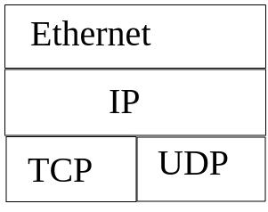

# Протоколы

### Основная информация

Сети в основном построены по принципу packet-switching, т.е. минимальная единица информации, которой обмениваются машины в сети - пакет. 
Пакет - это просто какой-то массив с байтами. Типичный размер пакета до 1200 байт(хотя специфические могут быть и больше).

У каждой машины внутри сети есть адрес. Адрес бывает:
+ 192.168.1.1 - 4 байта в случае IPv4;
+ 1b00:1261:1204:c01::33 - 16 байт в случае IPv6.

0.0.0.0 - специальный адрес, означающий, что клиент/сервер принимает запросы со всех адресов.

В пакете хранится адрес получателя и адрес отправителя.

На каждом хосте(сервере) запущен не один сервис. 
Чтобы различать, какому сервису отправлен пакет, используются порты. 
В рамках одного сервера могут работать несколько сервисов, причём каждый на своём порту. 
Таким образом можно запускать можно сервисов на одном сервере и с помощью порта понимать, кому конкретно отправляется пакет. port - число от 0 до 65536.

Однако пользователи/сервера идентифицируются не просто адресом.
Если бы сервис пытался отличать пользователя только по адресу, то получается, что все одинаковые адреса являлись одним пользователем.
Тут возникает проблема с тем, кому отправлять ответ в случае, если у нас открыто несколько вкладок. Адрес же один. Потому каждый пользователь(вкладка в данном случае) также имеет свой порт и идентифицируется как (ip, port). Получим, что у разных вкладок разные порты.

Работать с адресом напрямую неудобно, т.к. одному домену могут соответствовать несколько адресов. 
Для устранения этой проблемы была придумана DNS(Domain Name System). 
Она умеет отвечать на запрос "какие адреса соответствуют доменному имени".

В консоли linux  можно использовать следующую команду:
```
$ dig vk.com
;; ANSWER SECTION:
vk.com.			759	IN	A	87.240.139.194
vk.com.			759	IN	A	93.186.225.208
vk.com.			759	IN	A	87.240.190.78
vk.com.			759	IN	A	87.240.137.158
vk.com.			759	IN	A	87.240.190.67
vk.com.			759	IN	A	87.240.190.72
```

Есть разные технологии передачи данных(3G, 4G, WiFi, Ethernet).

Протоколы передачи не являются монолитным объектом. 
Они существуют в несколько слоёв, причём друг о друге ничего не знают, что делает систему довольно гибкой и удобной для модификации.
На практике это выглядит так:



UDP просто добавляет слой портов, т.е. записывает на пакет оставшуюся информацию и кидает в сеть. 

UDP:
+ никаких гарантий на доставку; 
+ передаёт пакеты до ~1000 байт(причём максимальный размер непонятен, т.к. протокол ничего не гарантирует; тут надо ещё каким-то образом узнавать максимальный размер пакета);
+ пакеты могут дойти в случайном порядке;
+ DNS работает поверх UDP.

TCP - протокол с гарантированной доставкой.

TCP:
+ передаёт поток байт;
+ для использования требуется установить соединение;
+ TCP-соединение - два потока байт(запись и чтение).

> Пусть есть некоторый сервер и клиент, котороый хочет с ним пообщаться. 
> Клиент создаёт подключение(обменялись некоторым количеством пакетов и теперь считают, что у них есть подключение). 
> Теперь протокол создают "иллюзию" наличия двух каналов данных(в обе стороны), причём под каналом имеется в виду просто непрерывнй поток байт. 
> При передаче в случае утери данных с помощью протокола клиент как-то понимает, что некоторый кусок информации был утерян и просто пересылает его, после чего сервер читает байты как будто ничего не терялось, просто непрерывными целыми кусками. Однако 100%-й гарантии нет.

Если посмотреть на пакет, в нём есть некоторый набор заголовков(от Ethernet, IP, протокола), а после идут сами данные.

В основном UDP используется в случаях, когда нужно низкоуровневое API, в случаях, если в вашем проекте свои протоколы, криптография и вы готовы взять ответственность за доставку на себя, но при этом хотите максимально всё оптимизировать.

### Как сеть выглядит с точки зрения приложения(TCP)

TCP/IP - это некоторое API, которое реализовано в операционной системе, и представляет собой набор системных вызовов. 
Чтобы с API взаимодействовать, существует socket.
Он может выполнять две роли: клиента и сервера.

Рассмотрим роль клиента.
 
Предположим, что мы как клиент хотим подключится к некоторому сайту. Нам нужно создать TCP-соединение и сообщить ОС, куда это соединение направлено.

1. Сначала всегда создаём socket. 
Тут нужно указать, по какому протоколу будем работать:
```
create TCP socket
```

2. Дальше его нужно подключить к серверу по ip-адресу и порту:
```
connect(ip, port)
```

Тут ОС выделяет свободный порт и начинает процесс подключения(обмен примерно 2мя пакетами в обе стороны). 
Если всё успешно, соединение считается установленным.

3. Теперь можно отправлять и получать данные:
```
send(bytes[])
recieve()
```

4. Закрываем соединение:
```
close().
```
